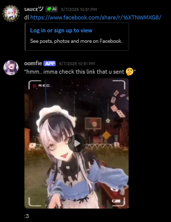

# 🍵 YouTube/Facebook/Instagram Video Downloader Discord Bot 🍵

I made this code in Python that allows you to download videos from Facebook Reels, Instagram Reels, and YouTube Shorts using your own discord bot. simply by sending a video link in your Discord channel. The bot will fetch and send the downloaded video directly in the channel for you. It is very helpful if you are scrolling through reels and wanting to share the video to your discord friends directly, rather than having to use the websites to download videos that sometimes comes with ads and it is very hassle and annoying.

>  **This was created for personal and educational purposes, so it may not be fully optimized.**

---

## Features

- [x] Downloads Facebook videos  
- [x] Downloads Instagram videos  
- [x] Downloads YouTube videos  
- [x] Converts YouTube videos to MP3  

---

## Limits

- Maximum file size is **8MB** (Discord file upload limit for bots)

---

## Invite the Bot

Want to try it out?

[Click here to invite the bot to your server](https://discord.com/oauth2/authorize?client_id=1352919755023188021&permissions=1689934340029504&integration_type=0&scope=bot+applications.commands)

> 📝 **Note:** This bot was made by me and is not online 24/7. It runs locally on my computer since I don’t have the financial means to host it continuously.

---

## How to Use

These are the bot commands:

# 🤖 BOT COMMANDS
```?commands            → Show all available commands```

```!sleep               → Shut down the bot (admin only)```

```dl [FB/IG link]      → Download media from Facebook or Instagram [8mb limit]```

```dlyt [YouTube link]  → Download YouTube video (MP4) [8mb limit]```

```dlmp3 [YouTube link] → Download YouTube audio (MP3) [8mb limit]```


---

## Installation

### Recommended Requirements

- Windows OS  
- Visual Studio Code  

---

## Screenshot



---

### Instructions

### 1. Clone the Repository
```sh
git clone https://github.com/ImSauce/Discord-Bot-Reels-Downloader.git
```

### 2. **Create a Discord Bot**  
   Go to the [Discord Developer Portal](https://discord.com/developers/applications) and create your bot. Save the token for later.

### 3. **Install Python 3.10+**  
   [Download Python here](https://www.python.org/downloads/)  
   Make sure to check **"Add Python to PATH"** during installation.

### 4. **Install FFmpeg**  
   [Download FFmpeg 7.1 (Windows 64-bit)](https://www.gyan.dev/ffmpeg/builds/)  
   Steps:
   - Extract the ZIP file
   - Copy the path to the `bin` folder (e.g., `C:\ffmpeg\bin`)
   - Open **System Properties > Environment Variables**
   - Under **System variables**, click **Path > Edit > New**, then paste the path
   - Click **OK** to save  
     Need help? [Watch this video](https://www.youtube.com/watch?v=JR36oH35Fgg)

### 5. **Install pip (if not already installed)**
   
   Check with:
   ```
   pip --version
   ```


## Not Installed?  
[Follow this guide](https://pip.pypa.io/en/stable/installation/)  

---

### 6. **Install Python Dependencies**
Run the following commands:

  ```pip install ffmpeg-python```
  
  ```pip install yt-dlp```
  
  ```pip install discord.py```
  
  ```pip install python-dotenv```


7.  Required Files
Make sure these files are set up before running the bot:

.env – Store your Discord bot token and sensitive info
``` DISCORD_TOKEN = "YOUR_DISCORD_BOT_TOKEN_HERE" ```

fb_cookie.txt – Store Facebook cookies 

insta_cookie.txt – Store Instagram cookies

config.py – Add your Discord user ID, channel ID for logging history, and channel ID's for channels that you want your bot to be active in.
```py
alert_channel_ids = [
     1353174572639322233,  #replace with your channels that you want the bot to be active in
    
]

LOG_CHANNEL_ID = 88181324234234   #replace with your channel for bot history logging

SAUCE_ID = 00923933333344343  #replace with your discord user id

newest_message_ids = {}
```


